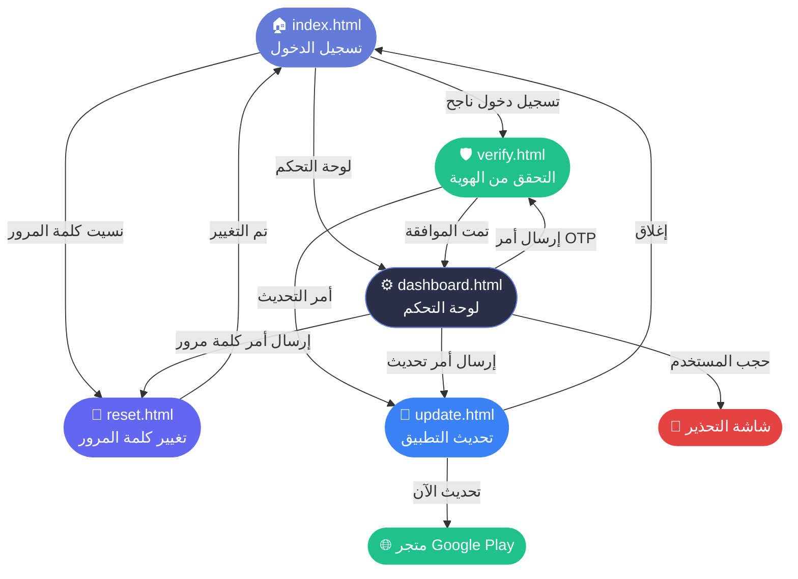

# شام كاش — موقع وهمي للتوثيق (Sham Cash Site)

موقع ثابت متعدد الصفحات يحاكي واجهة تطبيق **شام كاش** مع لوحة تحكم إدارية.  
مبني بـ HTML + CSS + JavaScript خالص — بدون أي إطار عمل — جاهز للنشر على **GitHub Pages**.

---

## 🗂 هيكل الملفات

```
shamcash-site/
├── index.html      ← صفحة تسجيل الدخول
├── verify.html     ← التحقق من الهوية (رقم كويك + تاريخ الميلاد)
├── reset.html      ← تغيير كلمة المرور (رمز أمان + كلمة مرور جديدة)
├── update.html     ← تحديث التطبيق (زر التحديث الآن + إغلاق)
├── dashboard.html  ← لوحة التحكم الإدارية
├── style.css       ← ملف التصميم المشترك
└── README.md       ← هذا الملف
```

---

## 🎨 لوحة الألوان

| الاسم        | الكود       | الاستخدام                        |
|-------------|-------------|----------------------------------|
| كحلي داكن   | `#0D1B2A`   | خلفية عامة                       |
| كحلي متوسط  | `#151c36`   | خلفية الصفحات                    |
| بطاقة       | `#2a3047`   | خلفية الحقول والبطاقات           |
| أزرق بنفسجي | `#657bd8`   | الأزرار الرئيسية / لون العلامة   |
| أخضر        | `#1fc28a`   | الموافقة / النجاح                |
| أحمر        | `#e54343`   | الخطأ / الرفض / الحجب            |
| أصفر        | `#F59E0B`   | التنبيهات                        |
| بنفسجي      | `#6366F1`   | تمييز إضافي                      |
| أزرق        | `#3B82F6`   | صفحة التحديث                     |

---

## 🔗 تدفق الصفحات



---

## 📄 وصف الصفحات

### `index.html` — تسجيل الدخول
- شاشة تحذير أولى (splash) عند أول زيارة — تُغلق بالضغط
- حقل البريد الإلكتروني + كلمة المرور
- رابط "تغيير كلمة المرور" → `reset.html`
- رابط "إنشاء حساب" (عرض فقط)
- زر تبديل اللغة (عربي / إنجليزي)
- رابط "لوحة التحكم" في الفوتر → `dashboard.html`

### `verify.html` — التحقق من الهوية
- حقل رقم كويك (QuickPay)
- حقل تاريخ الميلاد
- زر تحقق → يحاكي انتظار موافقة المشرف
- يقرأ الأمر من `localStorage` (`sham_verify_status`)

### `reset.html` — تغيير كلمة المرور
- حقل رمز الأمان
- حقل كلمة المرور الجديدة
- حقل تأكيد كلمة المرور
- التحقق من تطابق كلمتي المرور قبل الإرسال
- يقرأ الأمر من `localStorage` (`sham_changepass_status`)

### `update.html` — تحديث التطبيق
- عنوان: **Application Update Required**
- زر **تحديث الآن** → يفتح رابط متجر Google Play (صفحة جديدة)
- زر **إغلاق** → يعود إلى `index.html`
- ⚠️ **لا يوجد أي طلب لكلمات المرور أو OTP**

### `dashboard.html` — لوحة التحكم
- تسجيل دخول بكلمة مرور المشرف (افتراضي: `admin123`)
- تبويب **الزوار** → يعرض الزوار المتصلين في الوقت الفعلي (عبر `localStorage`)
- تبويب **الطلبات** → يعرض البيانات المُدخلة (كويك / كلمة مرور) مع زري موافق / رفض
- تبويب **التوجيه** → إرسال أوامر للمستخدم الحالي (OTP / كلمة مرور / تحديث / حجب)

---

## 🚀 تشغيل محلي

افتح `index.html` مباشرة في المتصفح — لا يلزم أي خادم.

```bash
# أو استخدم خادماً بسيطاً
npx serve .
```

---

## 🌐 النشر على GitHub Pages

1. أنشئ مستودعاً باسم `shamcash-site`
2. ارفع جميع الملفات إلى الفرع الرئيسي (`main`)
3. اذهب إلى **Settings → Pages → Source: main / root**
4. سيكون الموقع متاحاً على:  
   `https://username.github.io/shamcash-site/`

---

## ⚙️ تغيير كلمة مرور لوحة التحكم

افتح `dashboard.html` وغيّر السطر:

```js
const ADMIN_PASS = 'admin123';
```

---

## 📝 ملاحظات

- جميع البيانات تُخزَّن في `localStorage` / `sessionStorage` — لا يوجد خادم خلفي.
- الهدف التوثيقي والتدريبي فقط.
- التصميم مبني على نفس ألوان وأسلوب تطبيق شام كاش الأصلي.
